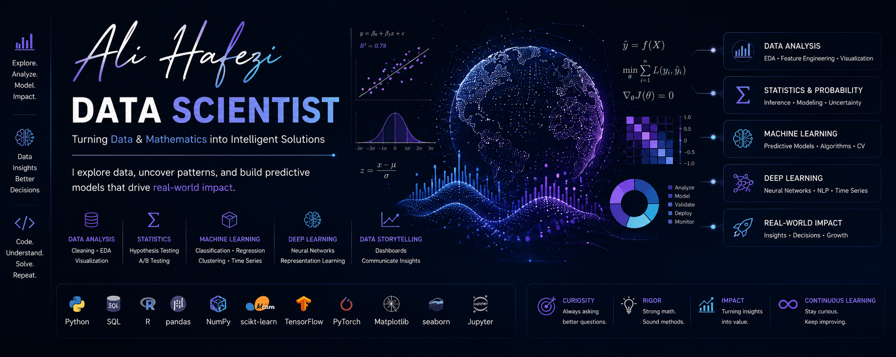

<h1 align="center">
  
</h1>

  

&nbsp;

&nbsp;

 

## 💻 About Me

Hey! I'm a Data Scientist and ML enthusiast with a Master's in Electrical Engineering from the University of Tehran. I love the challenge of bridging the gap between complex algorithms and practical, real-world solutions. 

My passion lies in architecting AI systems that are both mathematically rigorous and genuinely helpful. Whether I'm training a new machine learning model, developing business intelligence dashboards, or optimizing AI workflows, my goal is always to turn raw data into smart, actionable decisions!

## 🎯 Technical Focus

*   **Machine Learning & Deep Learning:** Building predictive models and exploring neural network architectures.
*   **Data Science & Business Intelligence:** Extracting meaningful signals from noisy data and crafting clear visual stories.
*   **AI & Large Language Models:** Fine-tuning Transformers and integrating intelligent models into practical applications.
*   **Ensemble Methods:** Designing creative, combined architectures to maximize model accuracy and stability.
*   **Computer Vision:** Developing robust image processing and pattern recognition pipelines.

## 📈 Current Projects

*   **Advanced Ensemble Learning:** Exploring new frontiers in combined model methodologies with some exciting experiments.
*   **Applied AI Solutions:** Architecting self-contained, real-world AI applications and optimizing local data environments.
*   **Full-Stack Integration:** Creating robust web solutions and responsive REST APIs using the Django framework.
*   **Data Strategy:** Collaborating on freelance analytics and BI tasks to help platforms leverage their data effectively.

## 🛠️ Tech Stack & Tools

  
**Languages & Scripting** 

  **Machine Learning & Data Science** 

  **Backend & Databases** 

  **DevOps & Infrastructure** 

## 🌐 Beyond the Code

Outside the realm of machine learning, I balance my technical work with a deep appreciation for the arts, nature, and culture. I'm an avid hiker and ecotourism enthusiast, and I love spending my downtime delving into historical studies, learning about diverse cultures, and immersing myself in thought-provoking films. 

I also enjoy expressing myself through music! Feel free to explore some of my favorite collected albums over on my SoundCloud profile.

   
  

---

  <h3>📬 Let's Connect</h3>
  
Feel free to reach out if you want to collaborate on AI projects, discuss data strategy, or share your favorite hiking trail recommendations!

